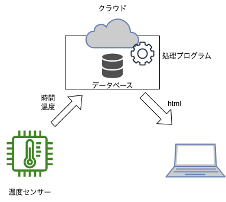

# SDPデモ

## 使用ツール及び機材
* ラズパイ
* AWS
* 温湿度センサー モジュール DHT22（AM2302）搭載

## システム概要
iotチックにしてみました。  
ラズパイから15分ごとにクラウドのDBへ温度と時間を送信  
クラウド上でwebアプリケーションを立ち上げてhtmlで表示するシステムにしてみました。  
モノをインターネットに繋ぐ  

ネットワークの授業ではないので簡略化しています  

## デモンストレーション
https://www.mura-re018.net/sdp  
これにアクセスするとクラウドのデータが個人のブラウザ上で参照できる  

## ビッグデータ
ビッグデータはこれをでかいスケールで行って収集したデータ  
